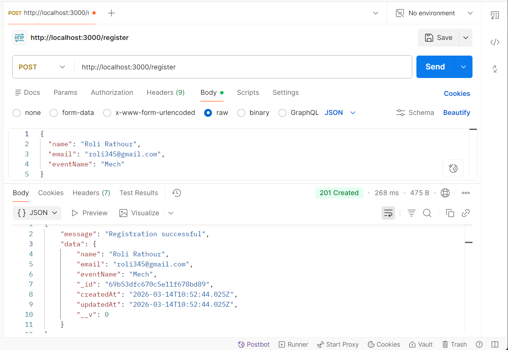
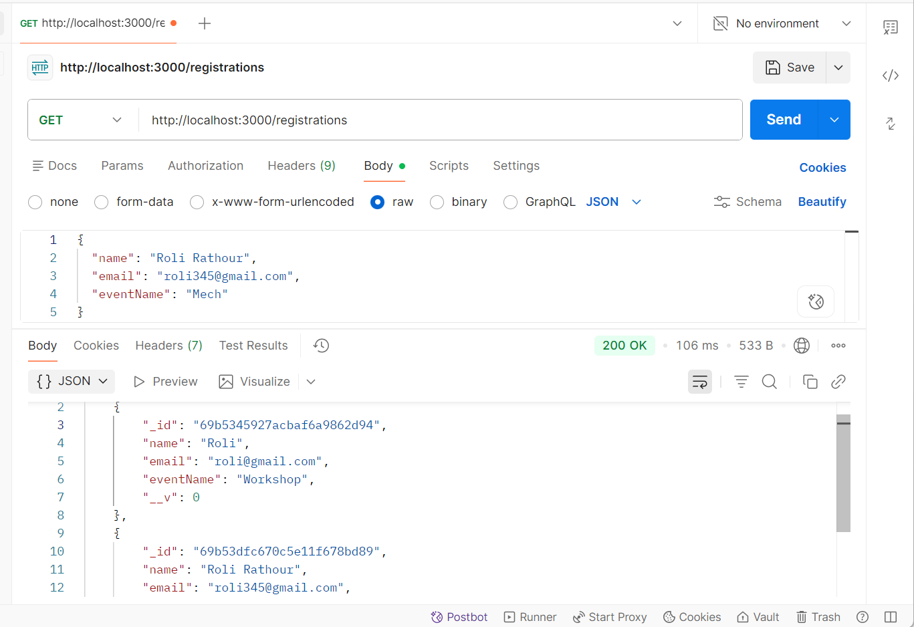
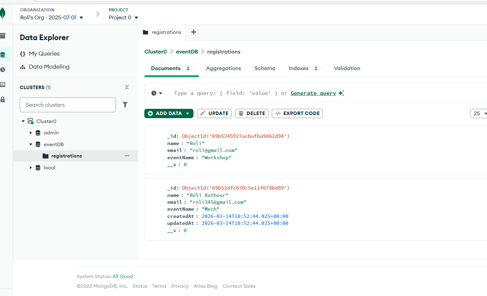

# Event Registration REST API

## Project Overview

This project is a REST API built using Node.js, Express.js, and MongoDB Atlas for event registration.

It allows:

* Registering participants for an event
* Fetching all registrations

---

## Tech Stack

* Node.js
* Express.js
* MongoDB Atlas
* Mongoose
* Postman

---

## Installation

Install dependencies:

npm install

---

## Environment Variable

Create a `.env` file in the root folder and add:

MONGO_URI=your_mongodb_atlas_connection_string

## Run the Server

node server.js

Expected output:

MongoDB Connected
Server running on port 3000

---

## API Endpoints

### POST /register

Register a participant.

URL:

http://localhost:3000/register

Body (JSON):

{
"name": "Roli",
"email": "[roli@gmail.com](mailto:roli@gmail.com)",
"eventName": "Workshop"
}

Response:

{
"message": "Registration successful",
"data": {
"name": "Roli",
"email": "[roli@gmail.com](mailto:roli@gmail.com)",
"eventName": "Workshop"
}
}

---

### GET /registrations

Fetch all registrations.

URL:

http://localhost:3000/registrations

Response:

[
{
"name": "Roli",
"email": "[roli@gmail.com](mailto:roli@gmail.com)",
"eventName": "Workshop"
}
]

---

## Features

* Input validation
* Duplicate email prevention
* MongoDB Atlas integration
* REST API structure

---

## Testing

Use Postman to test API endpoints.

---

## Screanshots

